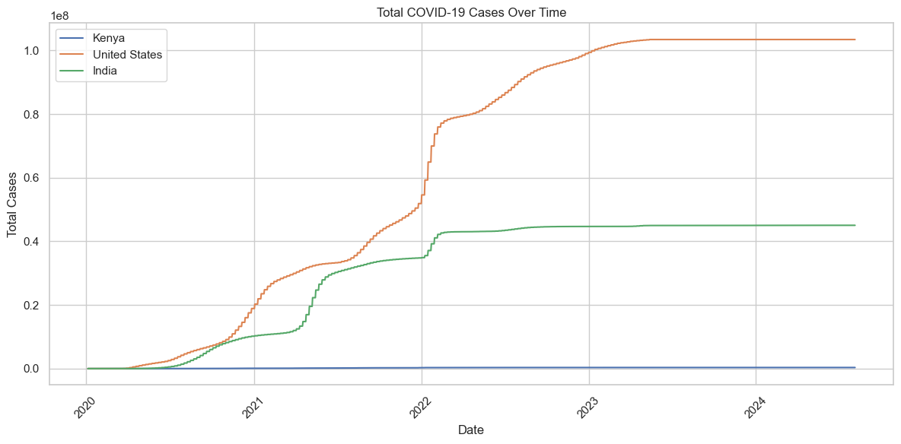
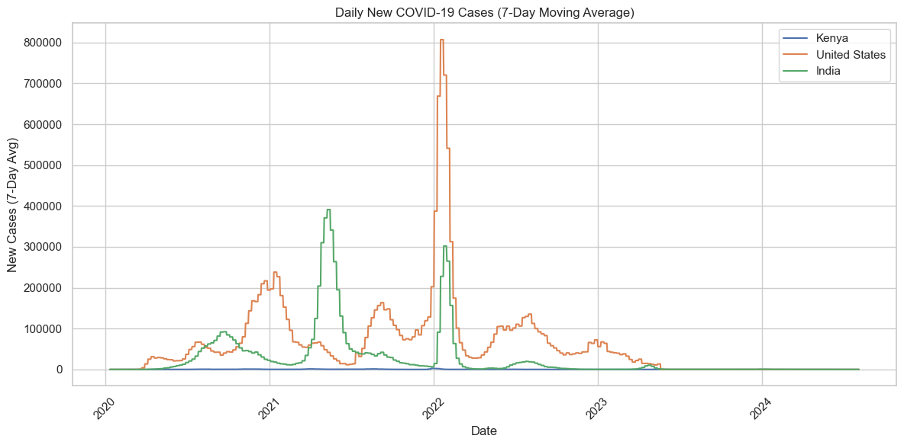

# COVID-19 Global Tracker

A Jupyter notebook that tracks COVID-19 cases, deaths and vaccinations over
time and compares Kenya, the United States and India. It uses the Our World in
Data dataset and draws line charts, bar charts and world maps.

## Who it is for

Anyone who wants a quick, visual comparison of how COVID-19 played out in
three countries, and students learning to clean and chart a large public
dataset with pandas.

## How to run it

1. Download `owid-covid-data.csv` from
   https://github.com/owid/covid-19-data/blob/master/public/data/owid-covid-data.csv
   (about 100 MB, so it is not in this repository).
2. Put the file in the project folder.
3. `pip install -r requirements.txt`
4. Open `covid_tracker.ipynb` in Jupyter and run all cells.

## What I built

- Loading and cleaning of the dataset for the three countries
- Line charts of total cases, total deaths, daily new cases (7-day average)
  and vaccinations over time
- A death rate comparison: deaths divided by confirmed cases
- World choropleth maps of total cases and share of people vaccinated
- A findings section in the notebook that sets out what the numbers show

Built with Python, pandas, matplotlib, seaborn, plotly and Jupyter.

## What the data shows

- The United States recorded the most cases (103.4 million) and deaths (1.19
  million), then India (45.0 million and 534 thousand), then Kenya (344
  thousand and 5.7 thousand).
- Deaths as a share of confirmed cases were highest in Kenya at 1.65 percent,
  against 1.18 percent for India and 1.15 percent for the United States.
- The tallest wave was the United States in January 2022, at about 800
  thousand new cases a day on a 7-day average. India's largest wave came in
  the first half of 2021, near 400 thousand a day.
- India shows 67 percent of its population fully vaccinated. Kenya and the
  United States show zero, which is a bug in the cleaning step, not a fact:
  their latest rows have no vaccination value and the notebook fills gaps with
  zero. The fix is to take the last reported value for each country.

## What I learned

[FILL IN: two or three sentences in your own words. For example: what cleaning
a 100 MB dataset taught you, how the fill-with-zero step produced a false
result, or what you would do to explain the death rate gap.]

## Data and licence

Data from Our World in Data. Code under the MIT licence.

## Author

Rehumile Masego Sechele, rehumiles@gmail.com
